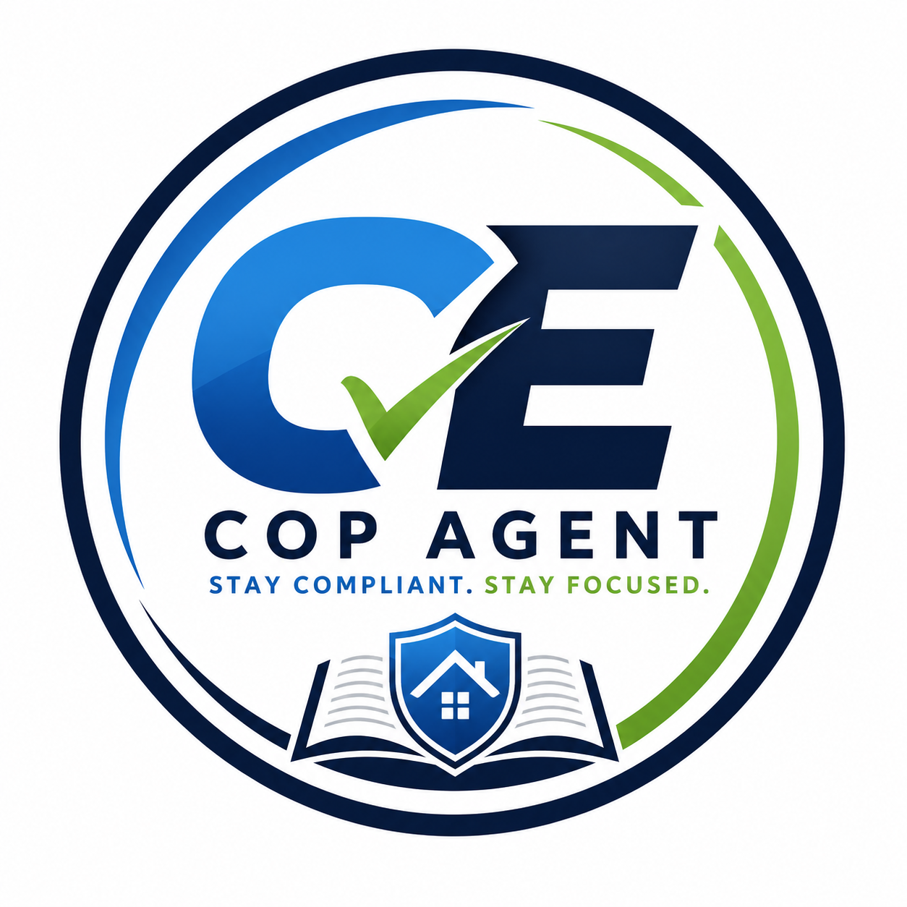

<p align="center">
  <a href="https://webnestam.github.io/CE-Cop-Agent">
    
  </a>
</p>

<h1 align="center">CE-Cop Agent</h1>

<p align="center">
  <strong>24/7 lead response and qualification assistant for real estate teams.</strong>
</p>

<p align="center">
  <a href="https://webnestam.github.io/CE-Cop-Agent"><strong>Live Site</strong></a>
  ·
  <a href="docs/LEAD_RESPONSE_AUDIT.md"><strong>Lead Response Audit</strong></a>
  ·
  <a href="docs/PILOT_OVERVIEW.md"><strong>Pilot Overview</strong></a>
  ·
  <a href="mailto:webnestam@gmail.com"><strong>Contact</strong></a>
</p>

<p align="center">
  
  
  
</p>

---

<p align="center">
  <em>You already paid for the lead. CE-Cop Agent helps make sure someone follows up fast enough.</em>
</p>

## Product Snapshot

| What it helps with | Why it matters |
| --- | --- |
| Instant first response | New buyer and seller inquiries are warm for minutes, not days. |
| Basic qualification | Capture intent, timeline, location, and preferred follow-up path before handoff. |
| Team routing | Push qualified leads toward the right agent, team lead, or callback workflow. |
| After-hours coverage | Reduce missed opportunities from nights, weekends, and busy showing days. |

## Built For

| Customer | Fit |
| --- | --- |
| Real estate teams | Teams with active listing, buyer, seller, and social lead flow. |
| Broker owners | Operators who need cleaner response without adding another full-time hire. |
| Portal/ad spenders | Teams paying for Zillow, Realtor.com, Google, Meta, or website traffic. |
| Founder-led pilots | Teams willing to review lead quality and workflow gaps directly. |

## How The Pilot Works

```text
New lead
  -> instant reply
  -> buyer/seller qualification
  -> intent + timeline summary
  -> team handoff
  -> human follow-up
```

| Step | Output |
| --- | --- |
| Map current lead sources | Website, social, portal, ad, and manual intake paths. |
| Identify response gaps | Where leads wait, get missed, or lack ownership. |
| Configure questions | Buyer/seller intent, timeline, budget, location, and contact preference. |
| Route qualified leads | Clear handoff summary for the right person on the team. |
| Review weekly | Improve response quality before scaling the workflow. |

## Repository Contents

```text
CE-Cop-Agent/
├── index.html                 # Public landing page
├── logo.png                   # Product logo
├── README.md                  # GitHub product overview
├── PRIVACY.md                 # Privacy policy
├── TERMS.md                   # Terms of service
├── SECURITY.md                # Security posture
└── docs/
    ├── LEAD_RESPONSE_AUDIT.md # Discovery/audit asset for prospects
    └── PILOT_OVERVIEW.md      # Founder-led pilot workflow
```

## Live Demo

The public site is hosted on GitHub Pages:

<p>
  <a href="https://webnestam.github.io/CE-Cop-Agent">
    
  </a>
</p>

## Local Preview

No install is required.

```bash
python -m http.server 8080
```

Then open:

```text
http://localhost:8080
```

## Trust Notes

- CE-Cop Agent is for ordinary business lead-response workflows.
- It should not receive sensitive financial, medical, government ID, or unrelated personal data.
- Human team members remain responsible for brokerage compliance, client service, and final follow-up.
- Pilot workflows should be reviewed before use in a live brokerage environment.

## Roadmap

| Area | Next |
| --- | --- |
| Lead audit | Sharpen the free audit into a repeatable discovery offer. |
| Routing | Create CRM-friendly lead summaries and owner notifications. |
| Qualification | Build source-specific buyer and seller question flows. |
| Backend | Add production workflow support for pilot customers. |

## Contact

For pilot access or questions:

<p>
  <a href="mailto:webnestam@gmail.com">
    
  </a>
</p>

## License

Proprietary. All rights reserved © 2026 CE-Cop Agent.
